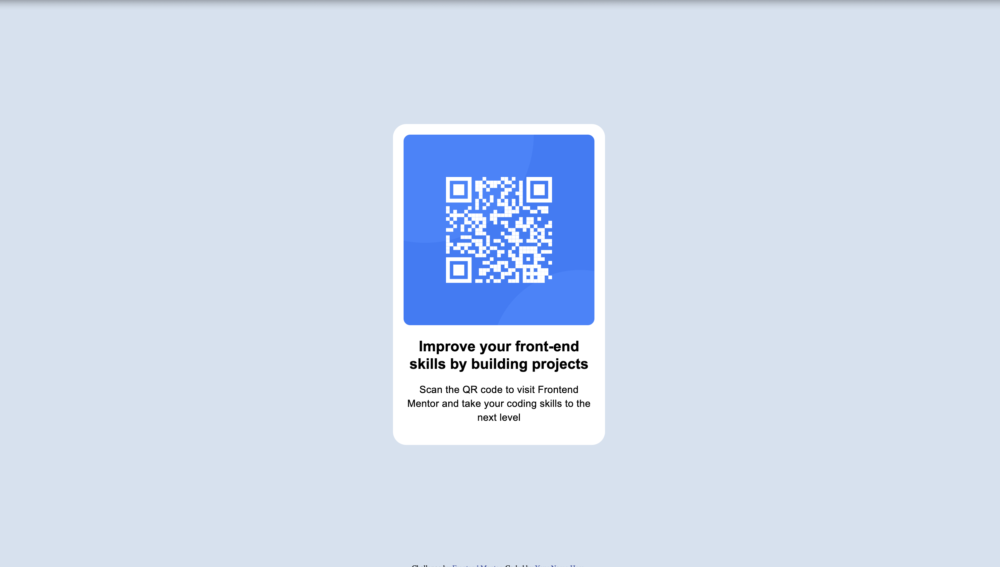

# Frontend Mentor - QR code component solution

This is a solution to the [QR code component challenge on Frontend Mentor](https://www.frontendmentor.io/challenges/qr-code-component-iux_sIO_H). Frontend Mentor challenges help you improve your coding skills by building realistic projects. 

## Table of contents

- [Overview](#overview)
  - [Screenshot](#screenshot)
  - [Links](#links)
- [My process](#my-process)
  - [Built with](#built-with)
  - [What I learned](#what-i-learned)
  - [Useful resources](#useful-resources)
- [Author](#author)
- [Acknowledgments](#acknowledgments)

## Overview

### Screenshot

### Links
- Live Site URL: [Add live site URL here](https://your-live-site-url.com)

## My process

### Built with

- Semantic HTML5 markup
- CSS custom properties
- Flexbox

### What I learned

This project is to brush up on my (long ago) knowledge on HTML and CSS. Nothing fancy, just basic HTML and CSS.

Two main things learned from this project:
- Positioning the items using Flexbox
- When sizing the items, try to minimize control on the size of the content, set the container size and let content flow; think about whether (min)height/(min)width should be set or not

### Useful resources

- [Web.dev HTML Guide](https://web.dev/learn/html/) - This guide is a good quick brush up on HTML basics.
- [Web.dev CSS Guide](https://web.dev/learn/css) - This guide is a good quick brush up on CSS basics.

## Author

- Personal Website - TBD
- LinkedIn - [Xingya Wang](https://www.linkedin.com/in/xingya-wang/)

## Acknowledgments

Special thanks to my mentor [@GregLyons](https://github.com/GregLyons) for guidance and advice.